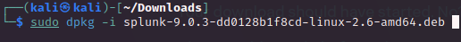
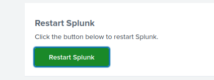

# Splunk Setup (Linux)
---

 

## Download Splunk from the official site
    
- On Splunks official website you'll need to create an account and login in order to download splunk. From the downloads page, download the .deb file for Linux.
`https://www.splunk.com/en_us/download/splunk-enterprise.html`

- On your system, Create a splunk user. Well use this user to start splunk  
`sudo adduser  --disabled-password   --no-create-home  splunk `

- navigate to the folder where its downloaded and install using the command below. It should be installed in /opt

    

 

## Start Splunk and setup Administrator credentials
- Switch to splunk user   `sudo su splunk`

- Start splunk using the command below (If you have issues starting splunk, see Troubleshooting tip below)  

- While installing it will ask you to setup a username and password, go ahead and create those credentials

 

- After finishing the setup, switch to root user and enable splunk to boot up when system restarts.  

> ## Troubleshooting
> Please note if its not booting up on start or issues starting splunk, some of the files in your `/opt/splunk` folder may not be owned by your "splunk" user, so use chown command recursively to fix that. You can also test this out by switching to your "splunk" user and starting splunk. If you see "permission denied" errors then it is definite that some files are not owned by your "splunk user". So make sure you correct that.

 

## Login to Splunk via web browser
- Open a web browser and go to the address: 
    > 127.0.0.1:8000

- You should see the login prompt for splunk, login with the credentials created during setup

## Enable HTTPS for Splunk
- After logging in, click on `Settings-->Server Settings-->General Settings`
- Then enable HTTPS, and click save at the bottom

    

    

    

 

- Afterwards you need to restart Splunk and your good to go! woOOhOooO!, now you just need to setup your receiver/forwarders. See my next guide.  

    

    

- Happy Splunkin!

